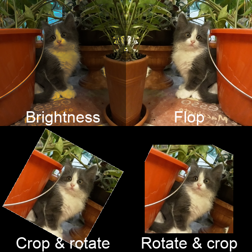
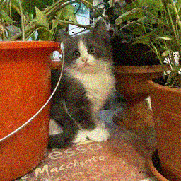

<!-- README.md is generated from README.Rmd. Please edit that file -->
augmentatoR
===========

The goal of `augmentatoR` package is to provide image augmentations for deep learning tasks: classification/regression, segmentation and object detection. `augmentatoR` is built on top of [magick](https://cran.r-project.org/web/packages/magick/) package as more powerfull alternative for `keras::image_data_generator`.

Installation
------------

You can install dev version of augmentatoR from [GitHub](https://github.com) with:

``` r
devtools::install_github("statist-bhfz/augmentatoR")
```

Example
-------

Test image:

``` r
library(augmentatoR)
#> Loading required package: magick
#> Linking to ImageMagick 6.9.9.14
#> Enabled features: cairo, freetype, fftw, ghostscript, lcms, pango, rsvg, webp
#> Disabled features: fontconfig, x11
img <- image_read("man/figures/README-test_image.jpg")
img
```


All transformations are controlled by single parameter `params`. Just modify default value to specify desired transformations and its settings (probability or intensity):

``` r
img_1 <- aug_img(img,  out_width = 256, out_height = 256, 
                 list(modulate = list(brightness  = c(50, 70), 
                                      saturation = c(100, 100), 
                                      hue = c(100, 100))))  
img_2 <- aug_img(img, out_width = 256, out_height = 256, 
                 list(flop = list(prob = 1)))
img_3 <- aug_img(img, out_width = 256, out_height = 256, 
                 list(crop = list(width = 180, 
                                  height = 180, 
                                  x_off = c(0, 30), 
                                  y_off = c(0, 30)), 
                      rotate = list(angle = c(25, 45))))
img_4 <- aug_img(img, out_width = 256, out_height = 256, 
                 list(rotate = list(angle = c(25, 45)),
                      crop = list(width = 180, 
                                  height = 180, 
                                  x_off = c(0, 30), 
                                  y_off = c(0, 30))))

img_1_2 <- c(
    image_annotate(img_1, "Brightness", gravity = "south", 
                   size = 32, color = "white"),
    image_annotate(img_2, "Flop", gravity = "south", 
                   size = 32, color = "white")
)

img_3_4 <- c(
    image_annotate(img_3, "Crop & rotate", gravity = "south", 
                   size = 32, color = "white"),
    image_annotate(img_4, "Rotate & crop", gravity = "south", 
                   size = 32, color = "white")
)

image_append(c(image_append(img_1_2), image_append(img_3_4)), 
             stack = TRUE)
```



You can also use augmentation not listed in `?aug_img` description:

``` r
aug_img(img, out_width = 256, out_height = 256, 
        list("noise" = list("gaussian")))
```



``` r
aug_img(img, out_width = 256, out_height = 256, 
        list("chop" = list(geometry_area(width = 30, 
                                         height = 0, 
                                         x_off = round(runif(1, 1, 256)), 
                                         y_off = 0))))
```


The last example follows the same pattern as provided in default `params`. The only difference is explicit using of random number generation.
